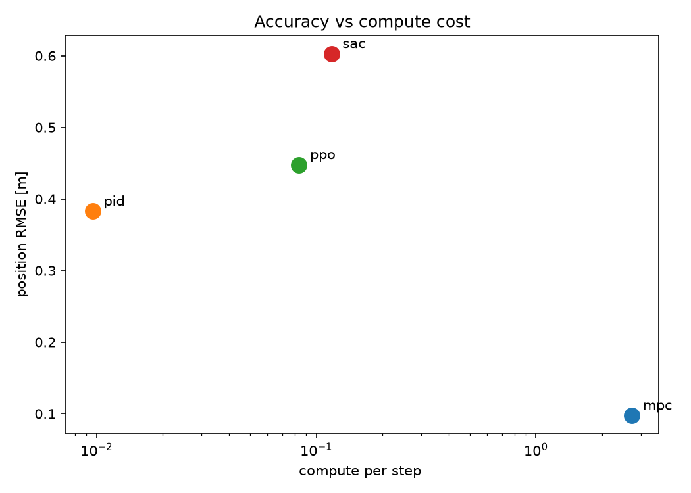
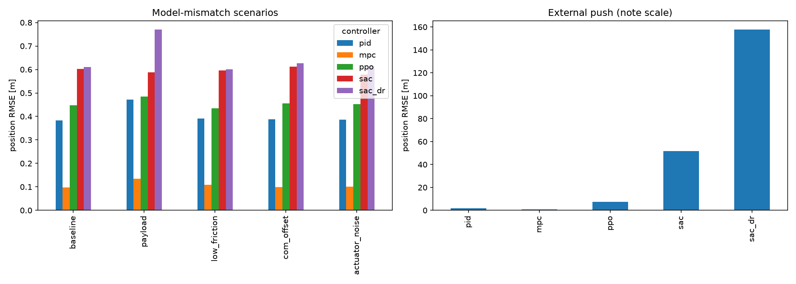
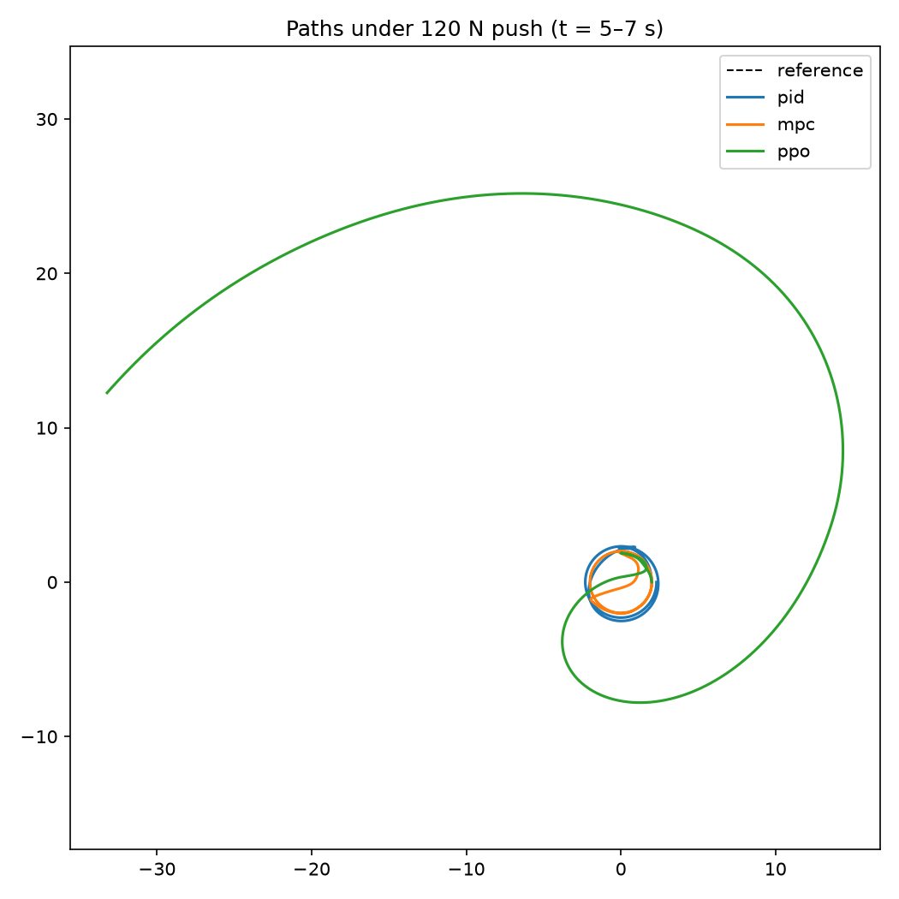
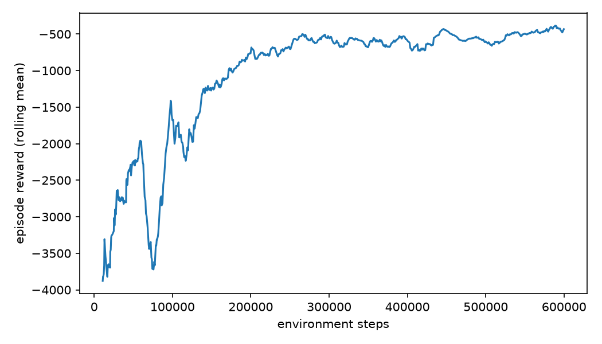

# Holonomic Control Benchmark

This project benchmarks three distinct control paradigms—classical (PID), model-based 
optimization (MPC), and deep reinforcement learning (PPO, SAC)—for trajectory tracking 
on a holonomic mecanum-wheel robot. The objective is to evaluate each controller against
shared reference paths and strictly quantify their trade-offs in accuracy, compute cost, 
and physical robustness.

## The robot and the simulator

The system uses real world mecanum platform to ensure validity : 
| Quantity | Value |
|---|---|
| Mass | 80 kg |
| Yaw inertia (Izz) | 11.2 kg·m² |
| Wheel radius | 0.128 m |
| Half-wheelbase | 0.457 m |
| Per-wheel force limit | 18.4 N |
| Top speed | ~3.2 m/s |
| Friction (static / kinetic) | 0.9 / 0.75 |(rubber over dry ashphat)

Given a strict 18.4 N force limit per wheel (max acceleration: ~0.92 m/s²), frequent 
actuator saturation is expected. This physical constraint explicitly tests MPC's
ability to optimize control inputs under boundary limits.

Engine: Custom pure-NumPy physics model, bypassing heavy simulators (e.g., Gazebo) to 
enable rapid, CPU-bound batch execution.

Actuation: Maps body-frame wrenches ([Fx, Fy, Mz]) to individual wheel forces, strictly 
enforcing hardware actuator and friction bounds.

Integration: 4th-order Runge-Kutta (RK4).

Dynamics: The platform exhibits strong nonlinear coupling between lateral velocity and 
yaw, explicitly necessitating the Nonlinear MPC (NMPC) formulation.
## The three controllers

**PID** runs three simple feedback loops (forward, sideways, heading). It reacts
to the current error and nothing else. It's the baseline. Note that in the final
tuning the heading loop uses derivative-only control, which was a deliberate
choice.

**MPC** (nonlinear model predictive control, built with CasADi and do-mpc) looks
ahead. Every tenth of a second it plans the next two seconds of wheel forces,
respecting the actuator limits directly, then executes the first step and
re-plans. It knows both the physics and the path that's coming.

**RL** (PPO and SAC from Stable-Baselines3) learns to drive from scratch by trial
and error in the simulator. it starts as a random neural network and improves by 
getting rewarded for staying near the target.

## Nominal results

Baseline Results: Mean tracking error and control cost across the circle, figure-8, 
and waypoint trajectories.

| Controller | Pos RMSE [m] | Compute [ms/step] |
|---|---|---|
| PID | ~0.38 | 0.01 |
| MPC | ~0.10 | 2.7 |
| PPO | ~0.45 | 0.08 |
| SAC | ~0.60 | 0.12 |

The clearest way to see the trade-off is accuracy against compute cost:



What this shows:

- **MPC is the most accurate by far** — several times better than everything
  else on the smooth paths, and it does it with slightly less control effort
  because looking ahead lets it lead the curve instead of chasing it.
- **The price is compute.** MPC spends about 2.7 ms per step versus PID's 0.01 ms
  and RL's ~0.1 ms. 
- **RL lands in the middle** on accuracy while thinking almost as cheaply as PID.
  SAC needed fewer training episodes than PPO to get there; PPO drove a little
  more smoothly. SAC was over 600_000 training episodes whereas PPO was trained
  over 700_000 to make the plot compareable.

## What happens when the robot stops matching the model

Robustness Evaluation
The controllers were evaluated against unmodeled dynamics to test zero-shot robustness:

Parametric Variations: Increased payload, reduced surface friction, CoM offsets, 
and actuator noise.

External Disturbances: Sudden impulse force (shove).

SAC-DR Baseline: A secondary SAC agent trained with domain randomization (varying mass, 
friction, CoM, and noise) to evaluate generalized adaptability.

Note: Results are split into two views. The external impulse causes extreme tracking 
failures in the RL agents, which would otherwise compress the scale of the parametric 
variation data.



The findings : 

- **MPC stayed strong across model mismatch.** Payload, friction, and the
  off-center mass barely moved it. This surprised me — I expected its clean model
  to be a weakness. The reason it isn't: MPC re-plans from the real measured state
  ten times a second, so the model only needs to be right about the *near* future,
  and small errors never get time to build up.
- **PID - degraded.** It's too simple to be badly wrong; it just keeps
  reacting, so it sags a little everywhere but never falls apart.
- **The learned RL controllers performed the worst.** The push knocked the
  robot into states the RL agents weren't able to tackle, and outside its
  experience a neural network extrapolates into nonsense. PID and MPC absorbed the
  same push and returned to the path.

You can see the shove and the recovery directly here (PID, MPC, and PPO shown —
SAC and SAC-DR left off because they fly too far to fit on the same axes):



## The Result: domain randomization didn't help

The whole reason to train SAC-DR was to make RL more robust. It didn't. On the
disturbances it was trained for, it was no better than plain SAC. On the shove —
which I never included in its training — it was actually **three times worse**
(about 158 m off the path versus plain SAC's 52 m).

The results demonstrate a fundamental limitation of domain randomization: robustness 
is strictly bounded by the randomized training distribution. Because external impulses 
were excluded from the training parameters, the disturbance was entirely out-of-distribution 
(OOD) for the SAC-DR agent. Furthermore, the aggressive control policy fostered by 
DR exacerbated instability during the impulse event rather than mitigating it.

           

## Key Takeaway:

The results clearly define the operational trade-offs of each paradigm. MPC maximizes tracking 
precision and robustness at a high computational cost. PID guarantees low-overhead reliability 
at the expense of tracking sharpness. RL delivers efficient nominal control but exhibits extreme 
fragility to out-of-distribution disturbances, proving that domain randomization is not a 
substitute for a generalized physical model. Ultimately, the classical and model-based 
controllers proved significantly more robust to unmodeled dynamics than the learned policies.

## Repository layout

```
config/         robot parameters
sim/            plant, trajectories, runner, disturbance model, RL environment
controllers/    pid, mpc, rl controller wrappers
notebooks/      per-controller experiments and analysis
results/        logged metrics (CSV), trained models, figures
```

Built with Python 3.11 — NumPy, SciPy, Gymnasium, Stable-Baselines3, CasADi,
do-mpc, Matplotlib, pandas.


